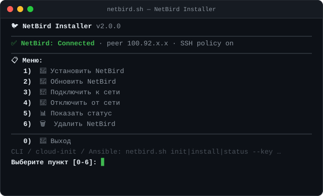

<div align="center">

# 🐦 NetBird Installer

[](#)
[](#)
[](./LICENSE)



**[English](#english)** · **[Русский](#русский)** · **[Main README](./README.md)**

</div>

---

## English

A script for quick [NetBird](https://netbird.io/) mesh-VPN installation and connection on Linux servers. Supports CLI, silent auto-install for provisioning, interactive menu, and Ansible modes. Works with both NetBird Cloud and **self-hosted** management.

### Features

🚀 One-liner installation · ☁️ cloud-init/provisioning mode (`init`) · 🔧 Interactive menu · 🤖 Ansible-friendly mode (no colors, clean exit codes) · 🏠 Self-hosted support (`--management-url`) · 🔑 Setup key via CLI, env var or `--setup-key-file` (never leaks to `ps`) · 📛 Custom peer name (`--hostname`) · 🔌 Custom WireGuard port (`--port`) · 🔐 SSH access between peers (`--ssh`) · 🔥 Auto-firewall (UFW/firewalld, `--no-firewall` to skip) · 🔄 `update` with version check · 🧹 `uninstall --purge` for configs · 📝 Logging to file · ✅ Setup-key validation · 🔍 Connection verification · ⚡ Force mode (`--force`) · 🔒 Concurrent-run lock · 🛠️ Automatic TUN device recovery

**Supported OS:** Ubuntu, Debian, CentOS, RHEL, Fedora, Rocky, Alma.

### Quick Start

```bash
# Silent auto-install for cloud-init / user-data
bash <(curl -Ls https://github.com/DigneZzZ/remnawave-scripts/raw/main/netbird.sh) init --key YOUR-SETUP-KEY

# CLI installation
bash <(curl -Ls https://github.com/DigneZzZ/remnawave-scripts/raw/main/netbird.sh) install --key YOUR-SETUP-KEY

# Self-hosted NetBird
bash <(curl -Ls https://github.com/DigneZzZ/remnawave-scripts/raw/main/netbird.sh) install --key YOUR-SETUP-KEY --management-url https://netbird.example.com:443

# Interactive menu
bash <(curl -Ls https://github.com/DigneZzZ/remnawave-scripts/raw/main/netbird.sh) menu
```

### Modes & Commands

| Mode | Command | Description |
|------|---------|-------------|
| **init** | `init --key KEY` | Silent auto-install for cloud-init/provisioning |
| **menu** | `menu` | Interactive menu |
| **ansible** | `ansible <cmd> --key KEY` | Silent mode for Ansible playbooks |
| **cli** | `<command> --key KEY` | Default CLI (see below) |

| Command | Description |
|---------|-------------|
| `install --key KEY` | Install NetBird and connect (key required) |
| `update` | Update NetBird to the latest version (with version check) |
| `connect --key KEY` | Connect an existing NetBird to the network |
| `disconnect` | Disconnect from the network |
| `status` | Show connection status (exit code 0 = connected, 1 = not) |
| `uninstall [--purge]` | Remove NetBird (`--purge` also removes `/etc/netbird` and friends) |
| `help` | Show help |

| Option | Description |
|--------|-------------|
| `--key, -k KEY` | Setup key (or env var `NETBIRD_SETUP_KEY`) |
| `--management-url, -m URL` | Self-hosted Management URL (or env `NETBIRD_MANAGEMENT_URL`) |
| `--hostname NAME` | Custom peer hostname in the NetBird network |
| `--port, -p PORT` | WireGuard port (default 51820; also opened in the firewall) |
| `--ssh` | Enable SSH access between peers |
| `--no-firewall` | Skip firewall configuration |
| `--purge` | With `uninstall`: remove configs too |
| `--force, -f` | Auto-accept all prompts (firewall, reinstall) |
| `--quiet, -q` | Minimal output |
| `--log FILE` | Write log to file |
| `--version, -v` | Show script version |
| `--help, -h` | Show help |

<details>
<summary><b>📋 More examples</b></summary>

```bash
# Auto-install with SSH access between servers
bash <(curl -Ls https://github.com/DigneZzZ/remnawave-scripts/raw/main/netbird.sh) init --key ABC123-DEF456 --ssh

# CLI install with auto-accept (no prompts)
bash <(curl -Ls https://github.com/DigneZzZ/remnawave-scripts/raw/main/netbird.sh) install --key ABC123-DEF456 --force

# Custom peer name and WireGuard port
bash <(curl -Ls https://github.com/DigneZzZ/remnawave-scripts/raw/main/netbird.sh) install --key KEY --hostname web-01 --port 51821

# Update / status / with logging
bash <(curl -Ls https://github.com/DigneZzZ/remnawave-scripts/raw/main/netbird.sh) update
bash <(curl -Ls https://github.com/DigneZzZ/remnawave-scripts/raw/main/netbird.sh) status
bash <(curl -Ls https://github.com/DigneZzZ/remnawave-scripts/raw/main/netbird.sh) install --key KEY --log /var/log/netbird-install.log

# Remove with configs
bash <(curl -Ls https://github.com/DigneZzZ/remnawave-scripts/raw/main/netbird.sh) uninstall --purge
```

</details>

### Exit Codes

| Code | Meaning |
|------|---------|
| `0` | Success |
| `1` | General error / NetBird not connected (`status`) |
| `2` | Invalid arguments (missing key, unknown option…) |
| `3` | TUN device missing (`/dev/net/tun`) |
| `4` | Installation failed |
| `5` | Connection failed |

### Security Notes

- The setup key is passed to `netbird up` via environment variables (`NB_SETUP_KEY`/`WT_SETUP_KEY`), never as a command-line argument — it stays out of `ps` output.
- `update`/reinstall stop the daemon and remove only the package; peer registration and config in `/etc/netbird` are preserved, so the peer reconnects without re-registration.
- `status` exit code reflects connectivity — handy for cron/monitoring checks.

### SSH Access Between Servers

The `--ssh` flag enables `--allow-server-ssh` (incoming SSH from NetBird peers) and `--enable-ssh-root` (root SSH access).

> ⚠️ You also need to create an **SSH Access Policy** in your NetBird dashboard (since NetBird v0.61.0).

### Cloud-Init / User-Data

```yaml
#cloud-config
runcmd:
  - bash <(curl -Ls https://github.com/DigneZzZ/remnawave-scripts/raw/main/netbird.sh) init --key YOUR-SETUP-KEY --ssh
```

### Ansible Integration

```yaml
- name: Install NetBird
  shell: |
    bash <(curl -Ls https://github.com/DigneZzZ/remnawave-scripts/raw/main/netbird.sh) \
    ansible install --key {{ netbird_setup_key }}
  register: netbird_result
  changed_when: "'OK' in netbird_result.stdout"
  failed_when: "'FAILED' in netbird_result.stdout"

- name: Check NetBird status
  shell: |
    bash <(curl -Ls https://github.com/DigneZzZ/remnawave-scripts/raw/main/netbird.sh) \
    ansible status
  register: netbird_status
  changed_when: false
```

Exit codes: `0` — success, non-zero — error (details in stderr, see the table above).

### Getting a Setup Key

[NetBird Dashboard](https://app.netbird.io/) (or your self-hosted instance) → **Setup Keys** → create or copy a key.

---

## Русский

Скрипт для быстрой установки и подключения [NetBird](https://netbird.io/) mesh-VPN на Linux-серверах. Поддерживает CLI, тихую автоустановку для provisioning, интерактивное меню и режим для Ansible. Работает и с NetBird Cloud, и с **self-hosted** management.

### Возможности

🚀 Установка одной командой · ☁️ Режим cloud-init/provisioning (`init`) · 🔧 Интерактивное меню · 🤖 Режим для Ansible (без цветов, корректные коды возврата) · 🏠 Поддержка self-hosted (`--management-url`) · 🔑 Setup key через CLI, env-переменную (не попадает в `ps`) · 📛 Имя пира (`--hostname`) · 🔌 Свой WireGuard-порт (`--port`) · 🔐 SSH-доступ между пирами (`--ssh`) · 🔥 Автонастройка файрвола (UFW/firewalld, `--no-firewall` для пропуска) · 🔄 Команда `update` с проверкой версии · 🧹 `uninstall --purge` для конфигов · 📝 Логирование в файл · ✅ Валидация setup-key · 🔍 Проверка подключения после установки · ⚡ Режим без подтверждений (`--force`) · 🔒 Блокировка параллельного запуска · 🛠️ Автовосстановление TUN-устройства

**Поддерживаемые ОС:** Ubuntu, Debian, CentOS, RHEL, Fedora, Rocky, Alma.

### Быстрый старт

```bash
# Тихая автоустановка для cloud-init / user-data
bash <(curl -Ls https://github.com/DigneZzZ/remnawave-scripts/raw/main/netbird.sh) init --key ВАШ-SETUP-KEY

# CLI-установка
bash <(curl -Ls https://github.com/DigneZzZ/remnawave-scripts/raw/main/netbird.sh) install --key ВАШ-SETUP-KEY

# Self-hosted NetBird
bash <(curl -Ls https://github.com/DigneZzZ/remnawave-scripts/raw/main/netbird.sh) install --key ВАШ-SETUP-KEY --management-url https://netbird.example.com:443

# Интерактивное меню
bash <(curl -Ls https://github.com/DigneZzZ/remnawave-scripts/raw/main/netbird.sh) menu
```

### Режимы и команды

| Режим | Команда | Описание |
|-------|---------|----------|
| **init** | `init --key KEY` | Тихая автоустановка для cloud-init/provisioning |
| **menu** | `menu` | Интерактивное меню |
| **ansible** | `ansible <cmd> --key KEY` | Тихий режим для Ansible-плейбуков |
| **cli** | `<команда> --key KEY` | CLI-режим (по умолчанию) |

| Команда | Описание |
|---------|----------|
| `install --key KEY` | Установить NetBird и подключить (ключ обязателен) |
| `update` | Обновить NetBird до последней версии (с проверкой версии) |
| `connect --key KEY` | Подключить существующий NetBird к сети |
| `disconnect` | Отключиться от сети |
| `status` | Показать статус (код 0 = подключен, 1 = нет) |
| `uninstall [--purge]` | Удалить NetBird (`--purge` — вместе с конфигами `/etc/netbird` и др.) |
| `help` | Показать справку |

| Опция | Описание |
|-------|----------|
| `--key, -k KEY` | Setup key (или переменная `NETBIRD_SETUP_KEY`) |
| `--management-url, -m URL` | Management URL для self-hosted (или env `NETBIRD_MANAGEMENT_URL`) |
| `--hostname NAME` | Имя пира в сети NetBird |
| `--port, -p PORT` | WireGuard-порт (по умолчанию 51820; также открывается в файрволе) |
| `--ssh` | SSH-доступ между пирами |
| `--no-firewall` | Не настраивать файрвол |
| `--purge` | С `uninstall`: удалить и конфиги |
| `--force, -f` | Автоподтверждение всех запросов (файрвол, переустановка) |
| `--quiet, -q` | Минимальный вывод |
| `--log FILE` | Записывать лог в файл |
| `--version, -v` | Версия скрипта |
| `--help, -h` | Показать справку |

<details>
<summary><b>📋 Больше примеров</b></summary>

```bash
# Автоустановка с SSH-доступом между серверами
bash <(curl -Ls https://github.com/DigneZzZ/remnawave-scripts/raw/main/netbird.sh) init --key ABC123-DEF456 --ssh

# CLI-установка без запросов
bash <(curl -Ls https://github.com/DigneZzZ/remnawave-scripts/raw/main/netbird.sh) install --key ABC123-DEF456 --force

# Своё имя пира и WireGuard-порт
bash <(curl -Ls https://github.com/DigneZzZ/remnawave-scripts/raw/main/netbird.sh) install --key KEY --hostname web-01 --port 51821

# Обновление / статус / с логированием
bash <(curl -Ls https://github.com/DigneZzZ/remnawave-scripts/raw/main/netbird.sh) update
bash <(curl -Ls https://github.com/DigneZzZ/remnawave-scripts/raw/main/netbird.sh) status
bash <(curl -Ls https://github.com/DigneZzZ/remnawave-scripts/raw/main/netbird.sh) install --key KEY --log /var/log/netbird-install.log

# Удаление вместе с конфигами
bash <(curl -Ls https://github.com/DigneZzZ/remnawave-scripts/raw/main/netbird.sh) uninstall --purge
```

</details>

### Коды возврата

| Код | Значение |
|-----|----------|
| `0` | Успех |
| `1` | Общая ошибка / NetBird не подключен (`status`) |
| `2` | Неверные аргументы (нет ключа, неизвестная опция…) |
| `3` | Отсутствует TUN-устройство (`/dev/net/tun`) |
| `4` | Ошибка установки |
| `5` | Ошибка подключения |

### Замечания по безопасности

- Setup key передаётся в `netbird up` через переменные окружения (`NB_SETUP_KEY`/`WT_SETUP_KEY`), а не через аргументы командной строки — ключ не виден в `ps` другим пользователям.
- `update` и переустановка останавливают daemon и удаляют только пакет; регистрация пира и конфиги в `/etc/netbird` сохраняются — переподключение происходит без перерегистрации.
- Код возврата `status` отражает подключённость — удобно для мониторинга и cron-проверок.

### SSH-доступ между серверами

Флаг `--ssh` включает `--allow-server-ssh` (входящий SSH от NetBird-пиров) и `--enable-ssh-root` (root-доступ по SSH).

> ⚠️ Дополнительно нужно создать **SSH Access Policy** в дашборде NetBird (начиная с NetBird v0.61.0).

### Cloud-Init / User-Data

```yaml
#cloud-config
runcmd:
  - bash <(curl -Ls https://github.com/DigneZzZ/remnawave-scripts/raw/main/netbird.sh) init --key ВАШ-SETUP-KEY --ssh
```

### Интеграция с Ansible

```yaml
- name: Установка NetBird
  shell: |
    bash <(curl -Ls https://github.com/DigneZzZ/remnawave-scripts/raw/main/netbird.sh) \
    ansible install --key {{ netbird_setup_key }}
  register: netbird_result
  changed_when: "'OK' in netbird_result.stdout"
  failed_when: "'FAILED' in netbird_result.stdout"
```

Коды возврата: `0` — успех, не ноль — ошибка (подробности в stderr, см. таблицу выше).

### Где взять Setup Key

[NetBird Dashboard](https://app.netbird.io/) (или self-hosted инстанс) → **Setup Keys** → создать или скопировать ключ.

---

<div align="center">

[Report Bug / Сообщить об ошибке](https://github.com/DigneZzZ/remnawave-scripts/issues) · [gig.ovh](https://gig.ovh) · **DigneZzZ** · [MIT License](./LICENSE)

</div>
