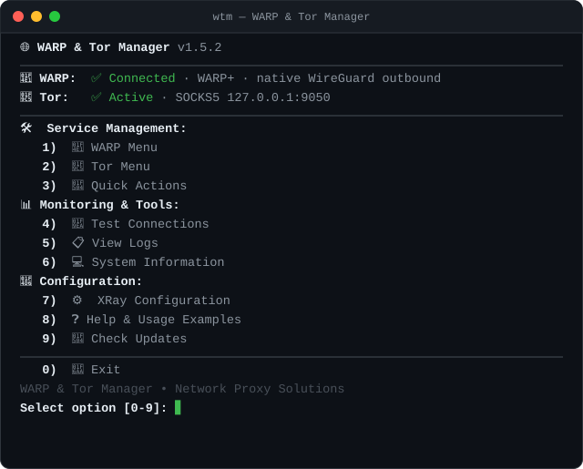

<div align="center">

# 🌐 WTM — WARP & Tor Manager

[](#-что-нового)
[](#-warp-подписка--license-key)
[](#-интеграция-с-xray)
[](./LICENSE)



**[Установка](#-установка)** · **[Команды](#-команды)** · **[WARP+](#-warp-подписка--license-key)** · **[Интеграция с Xray](#-интеграция-с-xray)** · **[Troubleshooting](#-устранение-неполадок)** · **[Главный README](./README_RU.md)**

</div>

**WTM** ставит и обслуживает **Cloudflare WARP** (WireGuard) и **Tor** на Linux-сервере и готовит их к использованию из **Xray**: генерирует нативный `wireguard`-outbound с вашими реальными ключами, следит за туннелем watchdog'ом и умеет апгрейдить аккаунт до **WARP+** по license key — без повторной регистрации.

Релиз от проектов [GIG.ovh](https://gig.ovh) и [OpeNode.xyz](https://openode.xyz).

## 🆕 Что нового

| Версия | Главное |
|---|---|
| **1.5.2** | Проверка соединения принимает `warp=plus`: у WARP+-аккаунтов Cloudflare trace возвращает `warp=plus`, а не `warp=on` — установка и апгрейд больше не рапортуют ложный сбой; `wtm test` явно помечает WARP+ (#36) |
| **1.5.1** | `wgcf` вызывается с `--config` (переменная окружения `WGCF_ACCOUNT` современным wgcf игнорируется) — `wtm status` теперь корректно показывает `Account: WARP+ / Free` |
| **1.5.0** | Поддержка **WARP+**: `wtm warp-plus <KEY>` для апгрейда на месте, `install-warp --license <KEY>` для установки сразу с подпиской |
| **1.4.2** | Host-вариант Xray (`freedom` + `sockopt.interface`) как полноценная альтернатива + cron-**watchdog** интерфейса `warp`; автовычисление `reserved` из вашей регистрации (#34), `wtm regen-warp-xray` |
| **1.4.1** | `"noKernelTun": true` по умолчанию в генерируемом outbound — работает из коробки в Docker/remnanode (read-only `/proc/sys` больше не роняет outbound) |
| **1.4.0** | Нативный `wireguard`-outbound вместо legacy-подхода; починена wgcf-регистрация (`--accept-tos`); убран опасный полный апгрейд ОС на RHEL-семействе; безопасное самообновление; рабочий `--force` |

<details>
<summary><b>📜 Подробности предыдущих версий (1.4.x)</b></summary>

**1.4.2**
- Host-вариант для Xray — второй готовый сниппет `/etc/wireguard/warp-sockopt-outbound.json` (`freedom` + `sockopt.interface: "warp"` + `tcpFastOpen`). Быстрее нативного (kernel WireGuard), ключи не попадают в конфиг Xray, но Xray должен видеть интерфейс `warp` (голый хост или `network_mode: host`).
- Watchdog (ставится автоматически при `install-warp`): cron раз в 5 минут проверяет юнит `wg-quick@warp`, возраст handshake (>180 с) и связность через туннель; при сбое перезапускает интерфейс (cooldown 120 с). Лог: `/var/log/wtm-warp-watchdog.log`.
- `reserved` для нативного outbound вычисляется из client_id вашей регистрации — некоторые PoP Cloudflare молча дропают handshake на общем `[0, 0, 0]`. Fallback на `[0, 0, 0]` при недоступном API; пересчёт: `wtm regen-warp-xray`.

**1.4.1**
- При дефолтном `noKernelTun: false` Xray пытается создать kernel-TUN с записью `rp_filter` в `/proc/sys` — в контейнере с read-only `/proc/sys` запись падает фатально, без отката на userspace. Поэтому в генерируемом конфиге теперь `true`; на голом хосте с `CAP_NET_ADMIN` можно вручную вернуть `false` ради производительности.

**1.4.0**
- Нативный `wireguard`-outbound: Xray (1.6.5+, актуально для ветки v26.x) подключается к WARP напрямую — без kernel-интерфейса и `wg-quick`. Скрипт сохраняет ключи и генерирует готовый сниппет с вашими значениями.
- `yes | wgcf register` больше не работает (интерактивный TTY-промпт ToS) → `wgcf register --accept-tos` с ретраями.
- На RHEL/Rocky/Alma/Fedora `yum/dnf update -y` делал полный апгрейд системы при любой установке → заменено на `makecache`.
- Самообновление: двухстадийная загрузка с валидацией shebang + версии (раньше битый файл при 404 рапортовался как успех).
- Tor: порты привязаны к `127.0.0.1`, `SocksPolicy accept 127.0.0.1 / reject *`, надёжная генерация хэша control-пароля. EL8: автоматическая установка `elrepo-release` + `kmod-wireguard`.

</details>

## ⚡ Установка

```bash
# Установка как глобальная команда wtm
sudo bash <(curl -sL https://github.com/DigneZzZ/remnawave-scripts/raw/main/wtm.sh) @ install-script

# Или сразу к делу — wtm установится глобально сам при любой install-команде
sudo bash <(curl -sL https://github.com/DigneZzZ/remnawave-scripts/raw/main/wtm.sh) @ install-all
```

После этого — `sudo wtm` для интерактивного меню, либо команды напрямую:

```bash
sudo wtm install-warp                    # только WARP
sudo wtm install-warp --license <KEY>    # WARP сразу с WARP+
sudo wtm install-tor                     # только Tor
sudo wtm install-all                     # оба сервиса
```

## 📋 Команды

| Команда | Описание |
|---|---|
| `install-warp [--license <KEY>]` / `install-tor` / `install-all` | Установка (есть `*-force`-варианты и флаг `--force`) |
| `start-warp` / `stop-warp` / `restart-warp` | Управление WARP (`wg-quick@warp`) |
| `start-tor` / `stop-tor` / `restart-tor` | Управление Tor |
| `watchdog-on` / `watchdog-off` | Cron-watchdog интерфейса `warp` |
| `status` | Статус сервисов + тип аккаунта (`WARP+` / `Free`) |
| `test` | Тест всех соединений (WARP+ помечается явно) |
| `logs warp` / `logs tor` | Логи сервисов (алиасы: `logs-warp`, `logs-tor`) |
| `warp-memory` / `system-info` | Диагностика памяти WARP / системная информация |
| `warp-plus <KEY>` | Апгрейд установленного WARP до WARP+ (идемпотентно) |
| `regen-warp-xray` | Пересобрать Xray-сниппеты + пересчитать `reserved` |
| `xray-examples` / `usage-examples` | Ваш готовый Xray-конфиг / примеры использования |
| `remove-warp` / `remove-tor` | Удаление (вычищает watchdog и сниппеты) |
| `self-update` / `check-updates` / `version` | Обновление скрипта (двухстадийное, с валидацией) |

## 🚀 WARP+ (подписка / license key)

По умолчанию регистрируется **бесплатный** аккаунт WARP (со скоростным лимитом). License key от **WARP+** снимает лимит.

> **Как это работает.** WARP+ — атрибут вашего **зарегистрированного устройства** (`device_id`) на стороне Cloudflare, а не отдельный туннель. Апгрейд применяется через `wgcf update` к тому же устройству: локальные ключи, endpoint и `reserved` **не меняются**. Xray-outbound'ы и `warp.conf` перегенерировать не нужно, повторная регистрация не требуется.

**Где взять ключ:** приложение **1.1.1.1 / WARP** → **Account → Key**. Формат: три группы по 8 символов, например `1a2b3c4d-5e6f7g8h-9i0j1k2l`.

```bash
# Новая установка сразу с WARP+
sudo wtm install-warp --license 1a2b3c4d-5e6f7g8h-9i0j1k2l
# (равнозначно: WARP_LICENSE_KEY=... sudo -E wtm install-warp)

# Апгрейд уже установленного WARP на месте (идемпотентно)
sudo wtm warp-plus 1a2b3c4d-5e6f7g8h-9i0j1k2l

# Проверить тип аккаунта
sudo wtm status        # строка "Account: WARP+ / Free"
```

То же доступно в меню: **WARP Menu → 9) Upgrade to WARP+**.

<details>
<summary><b>🔧 Вручную через wgcf (без скрипта)</b></summary>

Заново регистрироваться не нужно — апгрейдим существующее устройство. Современный `wgcf` берёт файл аккаунта **только через `--config`** (переменная `WGCF_ACCOUNT` игнорируется — это чинилось в wtm v1.5.1):

```bash
# 1. Вписать ключ в существующий аккаунт (файл создаётся при install-warp)
sudo sed -i "s|^license_key.*|license_key = '1a2b3c4d-5e6f7g8h-9i0j1k2l'|" \
    /etc/wireguard/wgcf-account.toml

# 2. Применить ключ к устройству на стороне Cloudflare
sudo wgcf update --config /etc/wireguard/wgcf-account.toml

# 3. Проверить, что аккаунт стал WARP+ (Account type: unlimited)
sudo wgcf status --config /etc/wireguard/wgcf-account.toml

# 4. Переподнять туннель, чтобы новый handshake подхватил снятый лимит
sudo systemctl restart wg-quick@warp
```

`wgcf generate` вызывать не обязательно: ключи и адреса не меняются.

</details>

> ⚠️ **Оговорки.**
> - Потребительский ключ WARP+ имеет **лимит устройств** (обычно 5). Повторное применение к тому же устройству слот не тратит — поэтому апгрейд на месте предпочтителен.
> - Cloudflare со временем ограничивает применение потребительских ключей к wgcf-устройствам. Если после апгрейда `wgcf status` показывает `limited`/`free` — ключ мог не примениться (лимит исчерпан или ключ недействителен для wgcf). Скрипт предупредит и продолжит на бесплатном аккаунте.
> - У WARP+ Cloudflare trace возвращает `warp=plus` (не `warp=on`) — wtm ≥1.5.2 учитывает это в проверках.
> - `/etc/wireguard/wgcf-account.toml` содержит `access_token` и `license_key` — права `600` (скрипт выставляет сам).

## 🎯 Интеграция с Xray

Скрипт готовит **оба** варианта подключения Xray к WARP — выбирайте по тому, где живёт Xray:

| | **A. Нативный `wireguard`-outbound** | **B. Host-интерфейс (`freedom` + `sockopt`)** |
|---|---|---|
| Файл | `/etc/wireguard/warp-xray-outbound.json` | `/etc/wireguard/warp-sockopt-outbound.json` |
| Где работает | **Везде**, включая Docker/remnanode (bridge) | Только если Xray видит интерфейс `warp`: голый хост или `network_mode: host` |
| Скорость | Userspace-стек (gVisor) | **Быстрее** — kernel WireGuard |
| Ключи WARP в конфиге Xray | Да | Нет |
| Стабильность | — | Watchdog перезапускает интерфейс при сбое |

**Как выбрать:** Xray в Docker → вариант A; Xray на хосте → вариант B. `sudo wtm xray-examples` покажет оба сниппета с вашими реальными значениями.

### Вариант A: нативный `wireguard`-outbound

```json
{
  "tag": "warp",
  "protocol": "wireguard",
  "settings": {
    "secretKey": "<wgcf PrivateKey>",
    "address": ["172.16.0.2/32", "2606:4700:110:...:c8e1/128"],
    "peers": [
      {
        "publicKey": "bmXOC+F1FxEMF9dyiK2H5/1SUtzH0JuVo51h2wPfgyo=",
        "endpoint": "engage.cloudflareclient.com:2408",
        "allowedIPs": ["0.0.0.0/0", "::/0"]
      }
    ],
    "reserved": [0, 0, 0],
    "mtu": 1280,
    "noKernelTun": true
  }
}
```

- `"noKernelTun": true` (дефолт с v1.4.1) — userspace-стек, работает в Docker/LXC и на read-only `/proc/sys`. На голом хосте с `CAP_NET_ADMIN` можно поставить `false` — kernel-TUN быстрее.
- `reserved` вычисляется автоматически из вашей регистрации. Если в файле осталось `[0, 0, 0]` (API был недоступен) — `sudo wtm regen-warp-xray`.
- На `wireguard`-outbound **нельзя** вешать `streamSettings`/`sockopt`; для цепочек используйте `dialerProxy`.

### Вариант B: host-интерфейс

```json
{
  "tag": "warp",
  "protocol": "freedom",
  "settings": { "domainStrategy": "UseIP" },
  "streamSettings": {
    "sockopt": { "interface": "warp", "tcpFastOpen": true }
  }
}
```

Тег `"warp"` совпадает с вариантом A — примеры роутинга ниже работают с любым из них. В один конфиг вставляйте только **один** вариант. За интерфейсом следит watchdog (`wtm watchdog-on/off`, лог `/var/log/wtm-warp-watchdog.log`).

<details>
<summary><b>🔀 Полный пример: WARP + Tor + роутинг</b></summary>

```json
{
  "outbounds": [
    { "tag": "direct", "protocol": "freedom" },
    {
      "tag": "warp",
      "protocol": "wireguard",
      "settings": {
        "secretKey": "<wgcf PrivateKey>",
        "address": ["172.16.0.2/32"],
        "peers": [
          {
            "publicKey": "bmXOC+F1FxEMF9dyiK2H5/1SUtzH0JuVo51h2wPfgyo=",
            "endpoint": "engage.cloudflareclient.com:2408"
          }
        ],
        "reserved": [0, 0, 0],
        "noKernelTun": true
      }
    },
    {
      "tag": "tor",
      "protocol": "socks",
      "settings": {
        "servers": [{ "address": "127.0.0.1", "port": 9050 }]
      }
    }
  ],
  "routing": {
    "domainStrategy": "IPIfNonMatch",
    "rules": [
      {
        "inboundTag": ["VTR-USA", "VTR-NL", "to-foreign-inbound"],
        "outboundTag": "tor",
        "domain": ["regexp:.*\\.onion$"]
      },
      {
        "inboundTag": ["VTR-USA", "VTR-NL", "to-foreign-inbound"],
        "outboundTag": "warp",
        "domain": [
          "geosite:category-ads-all",
          "geosite:google",
          "geosite:cloudflare",
          "geosite:youtube",
          "geosite:netflix"
        ]
      },
      {
        "inboundTag": ["VTR-RU", "VTR-LOCAL", "local-inbound"],
        "outboundTag": "direct",
        "domain": ["geosite:private", "geosite:cn", "geosite:ru"]
      }
    ]
  }
}
```

Маршрутизация: `.onion` → Tor SOCKS5; реклама/стриминг с иностранных inbound'ов → WARP; локальные inbound'ы + Private/RU/CN → напрямую.

> `"type": "field"` в правилах актуальному Xray больше не нужен. Теги `geosite:`/`geoip:` требуют `geosite.dat`/`geoip.dat` в `/usr/local/share/xray/` (или `XRAY_LOCATION_ASSET`).

</details>

## 📡 Порты, сервисы и файлы

| | WARP | Tor |
|---|---|---|
| Сервис | `wg-quick@warp` | `tor` |
| Порты / интерфейс | интерфейс `warp`, endpoint `engage.cloudflareclient.com:2408` | SOCKS5 `127.0.0.1:9050`, Control `127.0.0.1:9051` |
| Конфиг | `/etc/wireguard/warp.conf` | `/etc/tor/torrc` |
| Учётные данные | `/etc/wireguard/wgcf-account.toml` (600) | `/etc/tor/.control_password` |
| Xray-сниппеты | `warp-xray-outbound.json` (A), `warp-sockopt-outbound.json` (B) в `/etc/wireguard/` | — |
| Watchdog | `/opt/wtm/warp-watchdog.sh`, cron `/etc/cron.d/wtm-warp-watchdog`, лог `/var/log/wtm-warp-watchdog.log` | — |
| Логи скрипта | `/var/log/wtm.log` | `/var/log/tor/tor.log` |

**Требования:** Ubuntu 20.04+ / Debian 11+ / RHEL-Rocky-Alma 8+ (на EL8 модуль WireGuard ставится из ELRepo автоматически) / Fedora 35+ · root · 1 ГБ RAM. Зависимости (`wireguard-tools`, `tor`, `wgcf`) ставятся сами.

## 🛠 Устранение неполадок

```bash
sudo wtm status && sudo wtm test    # первый шаг диагностики
```

<details>
<summary><b>WARP не подключается</b></summary>

```bash
ip link show warp                                   # интерфейс поднят?
sudo journalctl -u wg-quick@warp -n 30 --no-pager   # логи сервиса
sudo systemctl restart wg-quick@warp                # перезапуск
curl --interface warp https://www.cloudflare.com/cdn-cgi/trace   # warp=on|plus?
```

Регистрация падает с 5xx — Cloudflare иногда отдаёт временные ошибки; скрипт делает до 3 попыток, можно повторить позже: `sudo wtm install-warp-force`.

Проверка «Connected» при WARP+: trace возвращает `warp=plus` — wtm ≥1.5.2 принимает оба значения; на старых версиях обновитесь (`sudo wtm self-update`).

</details>

<details>
<summary><b>Tor не работает / конфликт портов</b></summary>

```bash
ss -tlnp | grep ':9050\|:9051'      # порты слушаются?
sudo journalctl -u tor -f           # логи
sudo tor --verify-config            # валидность конфига
sudo lsof -i :9050                  # кто занял порт
```

</details>

<details>
<summary><b>Быстрые проверки через прокси</b></summary>

```bash
curl ifconfig.me                          # напрямую
curl --interface warp ifconfig.me         # через WARP (host-интерфейс)
curl --socks5 127.0.0.1:9050 ifconfig.me  # через Tor
# ProxyChains: socks5 127.0.0.1 9050 в /etc/proxychains.conf
```

</details>

---

<div align="center">

**Документация:** [Cloudflare WARP](https://developers.cloudflare.com/warp-client/) · [WireGuard](https://www.wireguard.com/quickstart/) · [Tor](https://www.torproject.org/docs/) · [Xray wireguard outbound](https://xtls.github.io/config/outbounds/wireguard.html) · [wgcf](https://github.com/ViRb3/wgcf)

[Сообщить об ошибке](https://github.com/DigneZzZ/remnawave-scripts/issues) · [Сообщество gig.ovh](https://gig.ovh) · Автор: **DigneZzZ**

</div>
