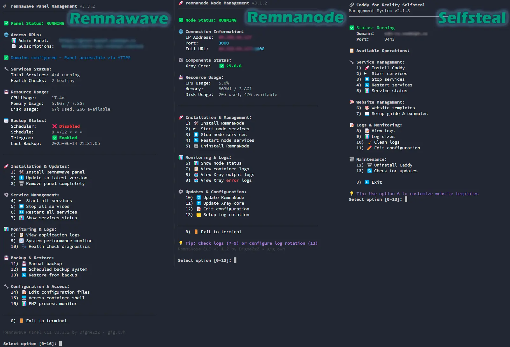

# Remnawave Scripts

[](./LICENSE)
[](#)
[](#)
[](#)



> **TL;DR:** One-liner scripts to deploy and manage **Remnawave Panel**, **RemnaNode**, and **Reality traffic masking** via Docker. Includes backup/restore, Telegram notifications, Caddy reverse proxy, and bilingual CLI (EN/RU).

**[📖 Readme на русском](/README_RU.md)** · **[💬 Support](https://gig.ovh/t/remnawave-managment-scripts-by-dignezzz/116)**

---

## 🚀 Quick Start

```bash
# Remnawave Panel
bash <(curl -Ls https://github.com/DigneZzZ/remnawave-scripts/raw/main/remnawave.sh) @ install

# RemnaNode
bash <(curl -Ls https://github.com/DigneZzZ/remnawave-scripts/raw/main/remnanode.sh) @ install

# Caddy Selfsteal (Reality masking)
bash <(curl -Ls https://github.com/DigneZzZ/remnawave-scripts/raw/main/selfsteal.sh) @ install
```

After installation, manage services with: `remnawave`, `remnanode`, or `selfsteal` commands.

---

## 📦 What's Included

| Script | Purpose | Install Command |
|--------|---------|----------------|
| **remnawave.sh** | Panel installer & manager | `remnawave <command>` |
| **remnanode.sh** | Node installer & manager | `remnanode <command>` |
| **selfsteal.sh** | Reality traffic masking | `selfsteal <command>` |
| **wtm.sh** | WARP & Tor Manager | `wtm <command>` |
| **netbird.sh** | NetBird VPN installer | `netbird.sh <command>` |

**Key features across all scripts:** auto-updates, interactive menus, bilingual interface (EN/RU), Docker Compose v2, idempotent operations.

---

## 🚀 Remnawave Panel

Full installer and manager for [Remnawave Panel](https://github.com/remnawave/) with backup/restore, Caddy proxy, Telegram integration, and subscription page management.

### Installation

```bash
# Standard install
bash <(curl -Ls https://github.com/DigneZzZ/remnawave-scripts/raw/main/remnawave.sh) @ install

# With options
bash <(curl -Ls https://github.com/DigneZzZ/remnawave-scripts/raw/main/remnawave.sh) @ install --name panel-prod --dev
```

| Flag | Description |
|------|-------------|
| `--name NAME` | Custom installation directory name |
| `--dev` | Install development version |

### Commands

<details>
<summary><b>📋 All Panel Commands</b></summary>

| Command | Description |
|---------|-------------|
| `install` | Install Remnawave Panel |
| `install-script` | Install management script only |
| `update` | Update script and containers |
| `uninstall` | Remove panel completely |
| `up` / `down` / `restart` | Service lifecycle |
| `status` | Show service status |
| `logs` | View container logs (`--follow`) |
| `edit` | Edit docker-compose.yml |
| `edit-env` | Edit .env file |
| `console` | Access panel CLI console |
| `backup` | Create backup (`--data-only`, `--no-compress`) |
| `restore` | Restore from backup (`--file FILE`, `--database-only`) |
| `schedule` | Manage scheduled backups |
| `subpage` | Subscription page settings |
| `subpage-token` | Configure API token |
| `subpage-restart` | Restart subscription-page |
| `install-subpage` | Install subscription-page only |
| `install-subpage-standalone` | Install subpage on separate server (`--with-caddy`) |
| `caddy` / `caddy up` / `caddy down` | Caddy management |
| `caddy logs` / `caddy edit` | Caddy logs & config |
| `caddy restart` / `caddy uninstall` | Caddy lifecycle |
| `caddy reset-user` | Reset Caddy admin password |

</details>

### Highlights

- **Auto-generation** of `.env`, secrets, ports, `docker-compose.yml`
- **Admin auto-creation** — credentials saved to `admin-credentials.txt`
- **Caddy Reverse Proxy** — Simple mode (auto SSL) or Secure mode (auth portal + MFA)
- **Backup system** — full/DB-only backups, cron scheduling, Telegram delivery, version-aware restore → see [💾 Backup, Restore & Migration](#-backup-restore--migration)
- **Variable migration** — deprecated env vars auto-removed on `update` (v2.2.0+)

<details>
<summary><b>🌐 Standalone Subscription-Page</b></summary>

Install subscription-page on a **separate server** connecting to your main panel via API:

```bash
bash <(curl -Ls https://github.com/DigneZzZ/remnawave-scripts/raw/main/remnawave.sh) @ install-subpage-standalone --with-caddy
```

The installer asks for panel URL, API token, and subscription domain, then generates a minimal docker-compose without DB dependencies.

</details>

<details>
<summary><b>📱 Telegram Integration</b></summary>

Configure in `.env`:

```bash
IS_TELEGRAM_NOTIFICATIONS_ENABLED=true
TELEGRAM_BOT_TOKEN=your_bot_token
TELEGRAM_NOTIFY_USERS_CHAT_ID=your_chat_id
TELEGRAM_NOTIFY_NODES_CHAT_ID=your_chat_id
```

Supports backup notifications, large file delivery (>50MB chunked), and thread-based group chats.

</details>

<details>
<summary><b>🔄 Variable Migration (v2.2.0+)</b></summary>

On `remnawave update`, deprecated env vars (OAuth, Branding) are auto-removed from `.env` with backup. Configure them in Panel UI instead:

- **Settings → Authentication → Login Methods** (OAuth)
- **Settings → Branding** (Logo, title)

</details>

<details>
<summary><b>📂 File Structure</b></summary>

```text
/opt/remnawave/
├── .env, .env.subscription
├── docker-compose.yml
├── app-config.json, backup-config.json
├── backup-scheduler.sh
├── backups/              # Backup storage
└── logs/                 # Operation logs

/opt/caddy-remnawave/     # Caddy (if installed)
├── docker-compose.yml, Caddyfile, .env
└── data/                 # SSL certs

/usr/local/bin/remnawave  # CLI command
```

</details>

---

## 💾 Backup, Restore & Migration

Built-in backup system in `remnawave.sh` with version-aware restore, cron scheduling, and Telegram delivery.

### Backup

```bash
remnawave backup                    # Full system backup (compressed .tar.gz)
remnawave backup --data-only        # Database only (.sql.gz)
remnawave backup --no-compress      # Uncompressed backup
```

### Scheduled Backups

```bash
remnawave schedule                  # Interactive cron schedule setup
```

Options: daily/weekly/monthly intervals, retention policies, compression settings, Telegram delivery.

### Restore

```bash
remnawave restore --file backup.tar.gz                  # Full restore (auto safety backup)
remnawave restore --database-only --file database.sql.gz # Database only
```

**Version checking:** major/minor versions must match for restore; patch differences show warnings but are allowed.

### Migration to Another Server

1. Create a backup on the **source** server:
   ```bash
   remnawave backup
   ```
2. Transfer the backup file to the **target** server (e.g., via `scp`)
3. On the **target** server, install and restore:
   ```bash
   bash <(curl -Ls https://github.com/DigneZzZ/remnawave-scripts/raw/main/remnawave.sh) @ install --name remnawave
   remnawave restore --file backup.tar.gz
   ```

<details>
<summary><b>🛠 Manual Restore (if automatic fails)</b></summary>

```bash
# Option A: New installation
sudo bash remnawave.sh @ install --name remnawave
sudo remnawave down
tar -xzf backup.tar.gz
cat backup_folder/database.sql | docker exec -i -e PGPASSWORD="password" remnawave-db psql -U postgres -d postgres
sudo remnawave up

# Option B: Existing installation
sudo remnawave down
cat database.sql | docker exec -i -e PGPASSWORD="password" remnawave-db psql -U postgres -d postgres
sudo remnawave up
```

</details>

---

## 🛰 RemnaNode

Installer and manager for **RemnaNode** proxy nodes with Xray-core integration. Multi-architecture support (x86_64, ARM64, ARM32, MIPS).

### Installation

```bash
# Interactive
bash <(curl -Ls https://github.com/DigneZzZ/remnawave-scripts/raw/main/remnanode.sh) @ install

# Non-interactive (force mode)
bash <(curl -Ls https://github.com/DigneZzZ/remnawave-scripts/raw/main/remnanode.sh) @ install \
    --force --secret-key="KEY" --port=3001 --xray
```

| Flag | Description | Default |
|------|-------------|---------|
| `--force`, `-f` | Skip all confirmations | — |
| `--secret-key=KEY` | SECRET_KEY from Panel (required in force mode) | — |
| `--port=PORT` | NODE_PORT | `3000` |
| `--xtls-port=PORT` | XTLS_API_PORT | `61000` |
| `--xray` / `--no-xray` | Install Xray-core | not installed in force mode |
| `--name NAME` | Directory name | `remnanode` |
| `--dev` | Development image | — |

### Commands

<details>
<summary><b>📋 All Node Commands</b></summary>

| Command | Description |
|---------|-------------|
| `install` | Install RemnaNode |
| `install-script` | Install script only |
| `update` | Update script and container |
| `uninstall` | Remove node |
| `up` / `down` / `restart` | Service lifecycle |
| `status` / `logs` | Status & logs |
| `core-update` | Update Xray-core binary |
| `edit` / `edit-env` | Edit configs |
| `setup-logs` | Configure log rotation |
| `xray_log_out` / `xray_log_err` | Xray real-time logs |

</details>

### Highlights

- **Xray-core** — auto-detection, interactive version selection, pre-release support
- **Log rotation** — 50MB max, 5 files, compressed, no downtime
- **Config migration** (v2.2.2+) — `APP_PORT` → `NODE_PORT`, `SSL_CERT` → `SECRET_KEY` (auto on `update`)
- **Dual config** — supports both `.env` and inline docker-compose variables

<details>
<summary><b>📂 File Structure</b></summary>

```text
/opt/remnanode/
├── .env
└── docker-compose.yml

/var/lib/remnanode/       # Xray binary & logs
/usr/local/bin/remnanode  # CLI command
/etc/logrotate.d/remnanode
```

</details>

---

## 🎭 Caddy Selfsteal (Reality Masking)

Deploy Caddy as a **Reality traffic masking** solution with professional website templates for HTTPS camouflage.

### Installation

```bash
bash <(curl -Ls https://github.com/DigneZzZ/remnawave-scripts/raw/main/selfsteal.sh) @ install
```

### Commands

| Command | Description |
|---------|-------------|
| `install` / `uninstall` | Install or remove |
| `up` / `down` / `restart` | Service lifecycle |
| `status` / `logs` | Status & logs |
| `template` | Manage website templates |
| `edit` | Edit Caddyfile |
| `guide` | Reality integration guide |
| `update` | Update script |

### Templates

8 pre-built website templates: `10gag`, `converter`, `downloader`, `filecloud`, `games-site`, `modmanager`, `speedtest`, `YouTube`.

```bash
selfsteal template list              # List templates
selfsteal template install converter # Install template
```

**Xray Reality config:**
```json
{ "realitySettings": { "dest": "127.0.0.1:9443", "serverNames": ["your-domain.com"] } }
```

<details>
<summary><b>📂 File Structure</b></summary>

```text
/opt/caddy/
├── .env, docker-compose.yml, Caddyfile
├── logs/
└── html/           # Template content
    ├── index.html, 404.html
    └── assets/

/usr/local/bin/selfsteal
```

</details>

---

## ⚙️ System Requirements

| | Minimum | Recommended |
|---|---------|-------------|
| **CPU** | 1 core | 2+ cores |
| **RAM** | 512 MB | 2 GB+ |
| **Storage** | 2 GB | 10 GB+ SSD |
| **Network** | Stable | 100 Mbps+ |

**OS:** Ubuntu 18.04+, Debian 10+, CentOS 7+, AlmaLinux 8+, Fedora 32+, Arch, openSUSE 15+

**Dependencies** (auto-installed): Docker Engine, Docker Compose V2, curl, openssl, jq, tar/gzip

---

## 🔐 Security

- Services bind to `127.0.0.1` by default
- Auto-generated DB credentials, JWT secrets, API tokens
- UFW/firewalld guidance during setup
- SSL/TLS via Caddy with DNS validation

<details>
<summary><b>🔒 Production Hardening</b></summary>

```bash
sudo ufw default deny incoming
sudo ufw default allow outgoing
sudo ufw allow ssh
sudo ufw allow from trusted_ip to any port panel_port
sudo ufw enable
```

</details>

---

## 📊 Monitoring & Logs

```bash
remnawave status && remnanode status && selfsteal status  # Service status
remnawave logs --follow    # Real-time logs
docker stats               # Resource usage
```

<details>
<summary><b>📋 Log Locations</b></summary>

| Component | Path |
|-----------|------|
| Panel | `/opt/remnawave/logs/` |
| Node (Xray) | `/var/lib/remnanode/` |
| Caddy | `/opt/caddy/logs/` |

Log rotation: 50MB max, 5 files kept, compressed automatically.

</details>

---

## 🧩 Other Scripts

This repository also includes additional utility scripts for network management and VPN setup.

### 🌐 WTM — WARP & Tor Manager

Professional tool for managing **Cloudflare WARP** and **Tor** on Linux servers. Includes XRay integration, interactive menus, and auto-updates.

```bash
# Install as global command
sudo bash <(curl -Ls https://github.com/DigneZzZ/remnawave-scripts/raw/main/wtm.sh) @ install-script

# Or run directly
bash <(curl -Ls https://github.com/DigneZzZ/remnawave-scripts/raw/main/wtm.sh)

# Install both WARP and Tor
sudo wtm install-all
```

Key features: WARP (WireGuard), Tor SOCKS5 proxy, XRay routing for `.onion` domains, connection testing, service monitoring.

📖 Full documentation: [README-warp.md](./README-warp.md)

### 🐦 NetBird — VPN Installer

Quick installer for [NetBird](https://netbird.io/) mesh VPN. Supports CLI, cloud-init, interactive menu, and Ansible modes.

```bash
# CLI installation
bash <(curl -Ls https://github.com/DigneZzZ/remnawave-scripts/raw/main/netbird.sh) install --key YOUR-SETUP-KEY

# Auto-install for cloud-init / provisioning
bash <(curl -Ls https://github.com/DigneZzZ/remnawave-scripts/raw/main/netbird.sh) init --key YOUR-SETUP-KEY

# Interactive menu
bash <(curl -Ls https://github.com/DigneZzZ/remnawave-scripts/raw/main/netbird.sh) menu
```

Key features: one-liner install, SSH access between peers (`--ssh`), auto-firewall setup (UFW/firewalld), Ansible-friendly mode.

📖 Full documentation: [README-netbird.md](./README-netbird.md)

---

## 🤝 Contributing

1. Fork → branch → make changes → test → PR
2. Follow existing code style, test on multiple distros
3. Check [existing issues](https://github.com/DigneZzZ/remnawave-scripts/issues) before reporting bugs

---

## 📜 License

[MIT License](./LICENSE) — free for commercial and private use.

---

<div align="center">

**⭐ Star this project if you find it useful!**

[Report Bug](https://github.com/DigneZzZ/remnawave-scripts/issues) · [Request Feature](https://github.com/DigneZzZ/remnawave-scripts/issues) · [Community: gig.ovh](https://gig.ovh)

</div>
